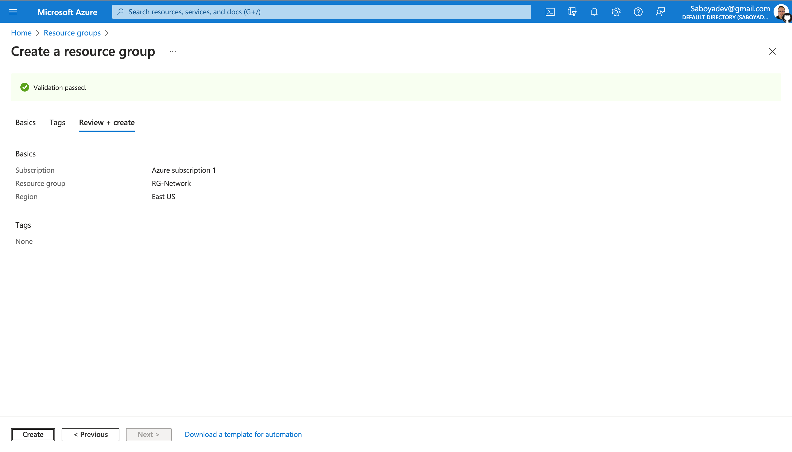

  

<h1>Network Security Groups (NSGs) and Inspecting Traffic Between Azure Virtual Machines</h1>

In this tutorial, we observe various network traffic to and from Azure Virtual Machines with Wireshark as well as experiment with Network Security Groups.  

<h2>Environments and Technologies Used</h2>

- Microsoft Azure (Virtual Machines/Compute)
- Remote Desktop
- Various Command-Line Tools
- Various Network Protocols (SSH, RDH, DNS, HTTP/S, ICMP)
- Wireshark (Protocol Analyzer)

<h2>Operating Systems Used </h2>

- Windows 10 Pro (22H2)
- Ubuntu Server 20.04

<h2>High-Level Steps</h2>

- Create Resources
- Observe ICMP Traffic
- Observe SSH Traffic
- Observe DHCP Traffic
- Observe DNS Traffic
- Observe RDP Traffic

<h2>Create a Resource Group</h2>

  
  
  

<h2>How to create a Virtual Machine</h2>

  
  

<h2>Create a Windows 10 Pro Virtual Machine</h2>

While creating the VM, select the previously created Resource Group and allow it to create a new <strong>Virtual Network (Vnet) and Subnet</strong>. Make sure to use the password option under the <strong>Administrator Account</strong> section (not seen in image):

  

<strong>\*\*\*(You can also create your own custom Virtual Network)</strong>

  

<h2>Create a Ubuntu Server 20.0.4 Virtual Machine</h2>

While creating the VM, select the previously created <strong>Resource Group</strong> and <strong>Virtual Network (Vnet) and Subnet</strong>. Make sure to use the password option under the <strong>Administrator Account</strong> section (not seen in image)

  

<h2>Observe Your Virtual Network Infrastructure with Network Watcher</h2>

  

<h2>Observing ICMP Traffic</h2>

  Remote into your Windows 10 Virtual Machine, install <strong><a href="https://www.Wireshark.org/">Wireshark</a></strong>, open it and filter for ICMP traffic only. If you are using a Mac like me, you'll have to download <strong><a href="https://apps.apple.com/us/app/microsoft-remote-desktop/id1295203466?mt=12">Microsoft Remote Desktop</a></strong> from the app store or install the cask via <strong><a href="https://formulae.brew.sh/cask/microsoft-remote-desktop">Homebrew</a></strong>:

  

<h3>- Private IP Address</h3>

Retrieve the <strong>private IP address</strong> of the Ubuntu VM

  

<h3>- Ping the Ubuntu VM</h3>

Attempt to ping it from within the Windows 10 VM. Observe ping requests and replies within Wireshark:

  

<h3>- Ping a Random Website</h3>

Attempt to ping a public website such as <strong>www.SaboyaDev.com</strong> and observe the traffic in Wireshark:

  

<h3>- Non-Stop Ping</h3>

Initiate a perpetual/non-stop ping from your Windows 10 VM to your Ubuntu VM:

  

<h3>- Network Security Group</h3>

Open the Network Security Group your Ubuntu VM is using and disable incoming <strong>(inbound) ICMP traffic</strong>, while back in the Windows 10 VM, observe the ICMP traffic in Wireshark and the command line Ping activity. Afterwards re-enable ICMP traffic for the Network Security Group in your Ubuntu VM and back in the Windows 10 VM, observe the ICMP traffic in Wireshark and the command line ping activity (should start working again).Finally, stop the ping activity.

  

  

<h2>Observing SSH Traffic</h2>

Back in Wireshark, filter for SSH traffic only and from your Windows 10 VM, “SSH into” your Ubuntu virtual machine (via its private IP address). Type commands (ls, pwd, etc) into the linux SSH connection and observe SSH traffic spam in Wireshark.

Exit the SSH connection by typing ‘exit’ and pressing [return]:

  

<h2>Observing DHCP Traffic</h2>

Back in Wireshark, filter for DHCP traffic only. From your Windows 10 VM, attempt to issue your VM a new IP address from the command line (ipconfig /renew)

Observe the DHCP traffic appearing in Wireshark:

  

<h2>Observing DNS Traffic</h2>

Back in Wireshark, filter for DNS traffic only.

From your Windows 10 VM within a command line, use nslookup to see what <strong><a href="www.github.com">Github</a></strong> and <strong><a href="www.nasa.gov">Nasa's</a></strong> IP addresses are and observe the DNS traffic being shown in Wireshark:

  

<h2>Observing RDP Traffic</h2>

Back in Wireshark, filter for RDP traffic only (tcp.port == 3389).

Observe the immediate non-stop spam of traffic? Why is it non-stop spamming vs only showing traffic when a command is inputted?

The answer is because the RDP (protocol) is constantly showing you a live stream from one computer to another, therefor traffic is always being transmitted:

  

<h2>Final Thoughts</h2>
This tutorial intention is to help people learn a little bit about network security protocols and observe traffic between virtual machines. I ran this on a my Mac Mini, this can be easily done on a PC without having to download a remote desktop app since Windows provides that with it's software.

<strong>DON'T FORGET TO CLEAN UP YOUR AZURE ENVIRONMENT</strong> so that you don't incur unnecessary charges.

Close your Remote Desktop connection, delete the Resource Group(s) created at the beginning of this tutorial, and verify Resource Group deletion.
